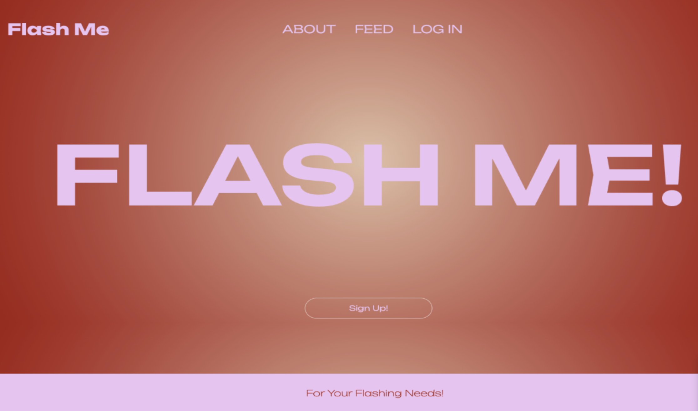
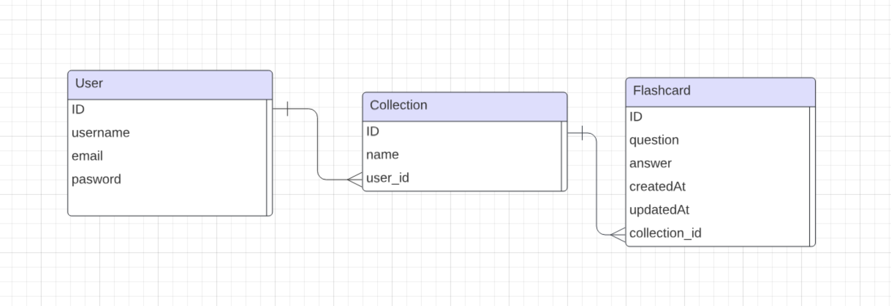

## flash-me 

https://flash-me-8481dc8f6f3f.herokuapp.com/

## Table of Contents
[Description](#description)
[Features](#features)
[License](#license)
[Technlogies](#technologies)
[Usage](#usage)
[Links](#links)

## Description
FLASH ME!, a Flashcard application an application created for a fun, interactive, engaging, and educational purpose. Users can create collections, post, share, and interact with flashcards. Users are able to create an account, log in, and create a  collection of flashcards. Each flashcard can contain a question and an answer.

## Features
User authentication: Users can sign up for an account and log in to access their collections.
Collection management: Users can create, view, edit, and delete collections of flashcards.
Flashcard creation: Within each collection, users can create flashcards with a question and an answer.
Feed page: Users can view a feed of all collections created by other users.
Profile page: Users can view their own profile, including their collections.

## License
N/A

## Technologies
NPM package Underscore_
Javascript
CSS
Bcrypt
MYSQL
Node.js
Express.js
Sequelize
Handlebars.js

## Usage
To use this application sign in and either view other users posts, navigate to your profile to view your own posts, or click on "Create Flashcards" to create your own.

## Links
Github Repository
https://github.com/cassidykovell/flash-me

Deployed
https://flash-me-8481dc8f6f3f.herokuapp.com/

## Credits
Cassidy Kovell, Rishi Alluri and Airin Grigorian

## Questions
 If you have questions please email. 
GitHub Username: cassidykovell
Github Profile link: https://github.com/cassidykovell
Email: cassidy0kovell@gmail.com

GitHub Username: Zafeera1
Github Profile link: https://github.com/zafeera1
Email: rnaz.alluri@gmail.com

GitHub Username: Agrig33
Github Profile link: https://github.com/Agrig33
Email: agrigorian33@gmail.com